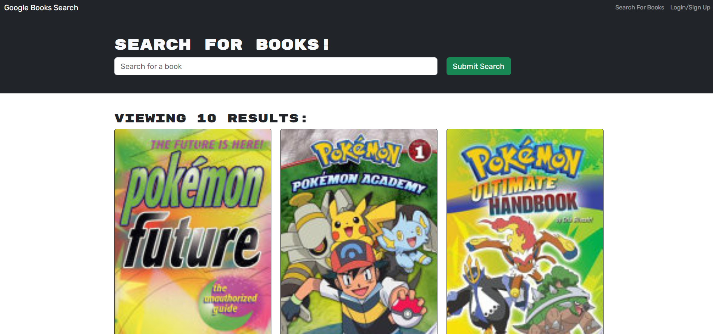
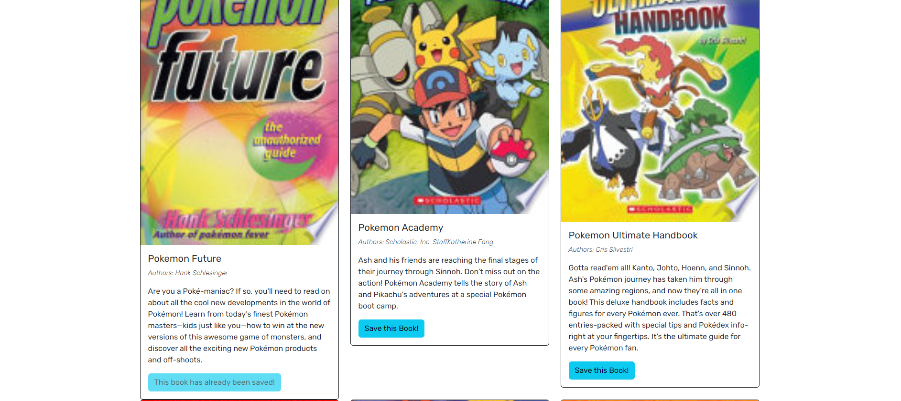
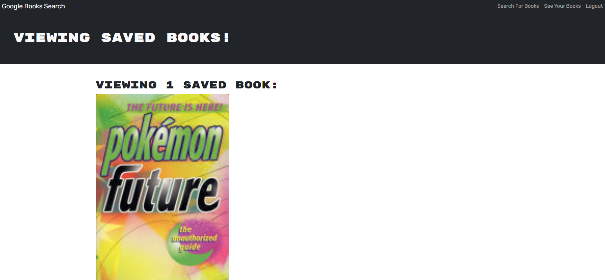
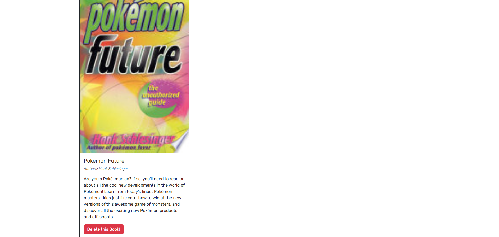

# Book-Emporium

-blue>)
-darkblue>)
-red>)
-yellow>)
-green>)
-Blue>)
-black>)
-purple>)

- An application that I refactored to use the latest technologies to manage and showcase books.

## Description

- <strong>Motivation:</strong> My motivation for building this application was to create a user-friendly and interactive platform for managing and showcasing books, aimed at using GraphQL instead of a REST API.
- <strong>Purpose:</strong> This project was built to demonstrate my skills in building a full-stack MERN application, providing a seamless and efficient user experience for managing book collections.
- <strong>Problem Solved:</strong> This solves the problem of presenting book collections in a static, less engaging format, by offering a dynamic and interactive experience.
- <strong>Learning Outcomes:</strong> In this project, I learned how to effectively use GraphQL for building interactive UIs, CSS for styling, HTML for structuring web content, and Node.js with Express and Mongoose for backend functionality. This was a refactor to learn how to use GraphQL instead of REST API.

## Table of Contents (Optional)

Here is a table of contents to make it easy for users to locate which section they need.

- [Installation](#installation)
- [Usage](#usage)
- [Credits](#credits)
- [License](#license)

## Installation

1. Install Required Software:

- GitBash: A command-line interface for Git.
- VS Code: An integrated development environment (IDE).
- Node.js and NPM: A JavaScript runtime and package manager.

2. Clone Your Repository:

- Open GitBash.
- Navigate to the directory where you want to store your project.
- Run `git clone <your-repo-url>` to clone the repository.

3. Open the Project in VS Code:

- Launch VS Code.
- Open the cloned repository folder.

4. Install Dependencies:

- Open the terminal in VS Code (View > Terminal or `Ctrl + ``).
- Run `npm install` to install the node_modules packages listed in your package.json.

5. Build and Start the Project:

- Run `npm run start` to start the server.

## Usage

The Book-Emporium is for managing and showcasing books, allowing employers to see my skills in building full-stack applications.

- <strong>Book Emporium Link</strong>

- [Website]()

- <strong>Book Emporium Screenshots</strong>

- 
- 
- 
- 

## Support

N/A

## Credits

People who worked on this project were Brennan Waterbury. You can contact the contributors through the GitHub profiles links listed here.

- <a href="https://github.com/bwater47" alt="GitHub Link">GitHub Profile - Brennan Waterbury</a>

## License

-
- This is an [https://choosealicense.com/licenses/mit/](https://choosealicense.com/licenses/mit/) license.

## Features

<strong>Book-Emporium</strong>: The Book-Emporium was created to manage and showcase book collections efficiently using the latest web technologies.

## Contributing

Contributing is allowed if you get in contact with me. Contact me by heading to my LinkedIn; otherwise, send me an email using the contact form on my portfolio.

- [Contributor Covenant](https://www.contributor-covenant.org/)

## Authors and Acknowledgment

Introduction to JSON Web Tokens. JWT.io. (07/25/24). https://jwt.io/introduction

Documentation. Mongoose. (07/25/24). https://mongoosejs.com/docs/

Tutorial V6.25.1. v6.25.1 | React Router. (07/25/24). https://reactrouter.com/en/main/start/tutorial

Quick start. React. (07/25/24). https://react.dev/learn#adding-styles

Getting started. vitejs. (07/25/24). https://vitejs.dev/guide/

NPM docs. npm Docs. (07/25/24). https://docs.npmjs.com/

CLI commands. npm Docs. (07/25/24). https://docs.npmjs.com/cli/v10/commands

Node.js V22.0.0 documentation. Command-line API | Node.js v22.0.0 Documentation. (07/25/24). https://nodejs.org/api/cli.html

MozDevNet. (07/25/24). Resources for developers, by developers. MDN Web Docs. https://developer.mozilla.org/en-US/

Bootcamp Spot. (07/25/24). https://bootcampspot.com/

W3Schools Online Web Tutorials. (07/25/24). https://www.w3schools.com/

Chatgpt. ChatGPT. (07/25/24). https://openai.com/chatgpt

• Please note: While ChatGPT was utilized to generate dialog content for the README file, it was not involved in the generation of any code, HTML edits, CSS edits, or other assets within the repository apart from this README specifically.

• All other sources, links, and information utilized within the project were obtained from the provided sources mentioned in this paragraph. This includes class materials, modules, TA guidance, instructor-provided resources, as well as communication through platforms such as Slack or Discord. Additionally, numerous links and resources were provided within the assignment instructions and demonstrated during class sessions.

## Roadmap

Tests: N/A

## Project status

In-Progress
